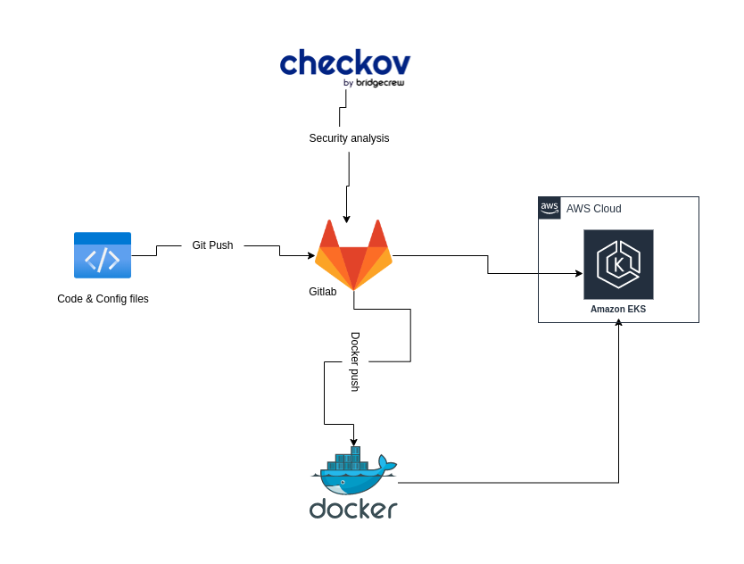

# Set up CI/CD Pipeline to deploy app to AWS EKS

# This repository contains configuration files and scripts used to set up a CI/CD pipeline that deploys a python web application on AWS EKS

## Structure of the git repository

..

├── Dockerfile

├── .gitlab-ci.yml

├── .k8s

│   ├── deployment.yaml

│   └── services.yaml

└── src

	├── app.py

	└── requirements.txt

* The src folder contains the python application and the requirement.txt
* The .k8s folder contains the kubernetes manifiest files
* The .gitlab-ci.yml and Dockerfile contain respectively the instructions for running the pipeline and containerization of the application.

## The .gitlab-ci.yml contains variables that you must define in your gitlab repo before continuing.

These variables are as follows: \

* **${CI_REGISTRY_USER}**: This variable is a GitLab CI/CD predefined variable that contains the username used to authenticate with Container Registry, it can be docker hub, gitlab registry or whatever you want
* **${CI_REGISTRY_PASSWORD}**: This variable is a GitLab CI/CD predefined variable that contains the password used to authenticate with the Container Registry..
* **${CI_REGISTRY_IMAGE}:** This variable is a GitLab CI/CD predefined variable that contains the name of the Docker image in the Container Registry.
* **${CI_REGISTRY_IMAGE_VERSION**}: This variable is a GitLab CI/CD predefined variable that contains the version or tag of the Docker image in the Container Registry.
* **${AWS_ACCESS_KEY_ID}**: This variable contains the access key ID for the AWS account used to deploy the application.
* **${AWS_SECRET_ACCESS_KEY}**: This variable contains the secret access key for the AWS account used to deploy the application.
* **${AWS_DEFAULT_REGION}:** This variable contains the AWS region where the application will be deployed.
* **${KUBECONFIG}**: This variable of type file  contains the Kubernetes configuration file used to authenticate with the K8s cluster. this file is available at this path ~/.kube/config

Once all these parameters are well defined you can proceed with the deployment, here is a guide to inspire you.

I remain open to any contribution and suggestion to improve my work. Do not hesitate to let me know your contribution or suggestion by opening an issue.
